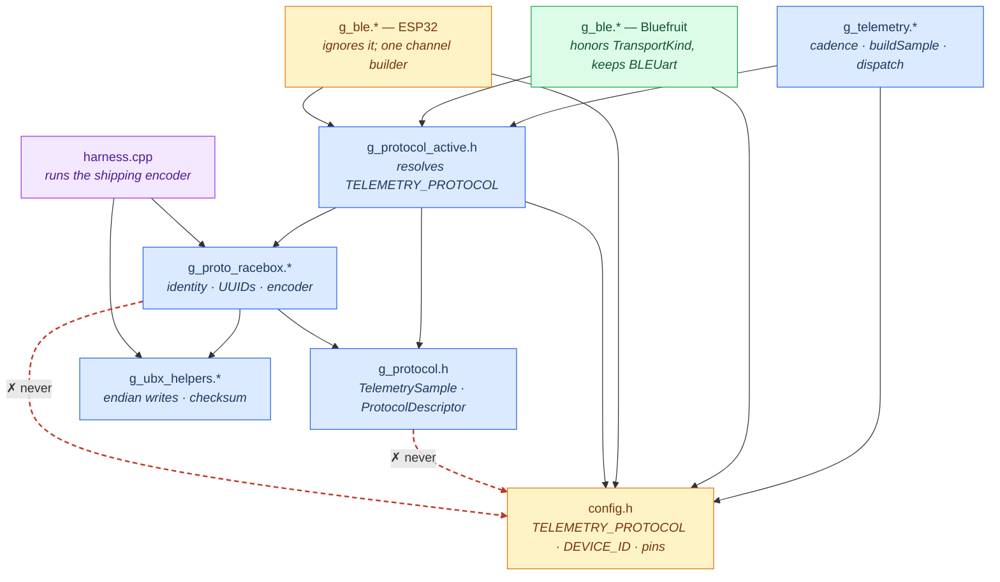

# Module dependencies and sharing scope

How the firmware's modules include one another, and which copies must stay
byte-identical. Companion to [`multiprotocol-design.md`](multiprotocol-design.md).

Only the modules that carry architectural meaning are shown. The sensor modules
(`g_gnss`, `g_imu`, `g_battery`) feed `g_telemetry` but say nothing about how
the protocol layer is put together — they appear in
[`architecture-runtime.md`](architecture-runtime.md) instead.



## The two red edges are the whole design

Everything else follows from them.

`g_protocol.h` and `g_proto_racebox.*` **must not include `config.h`**, and that
single constraint is what makes the rest possible:

- **It lets `harness.cpp` exist.** `config.h` pulls in `Arduino.h` and per-board
  pin macros. An encoder that reached for it could not be compiled on a Mac, and
  the wire format could only ever be tested by flashing a device — which cannot
  feed it chosen inputs, so the `fixType` clamp and the numeric edges would go
  untested forever.
- **It lets one encoder serve two BLE stacks.** Nothing in the protocol layer
  names a Bluefruit or ESP32 type, so a single copy compiles for both.

The same rule is why `DEVICE_ID` is *not* baked into the descriptor: the
advertised name is composed in `g_ble` as `"<modelName> <DEVICE_ID>"`, because
that is the one module that legitimately sees both sides.

It is also why `g_protocol_active.h` is a separate file rather than part of
`g_protocol.h`. Resolving `TELEMETRY_PROTOCOL` requires reading `config.h`, so
the selector takes that dependency and the contract stays clean. The harness
includes the contract and the encoder, never the selector.

## Reading the boxes

| Colour | Scope | Meaning when you edit it |
|---|---|---|
| blue | **all-variant** | Change one copy → copy to the other two sketch folders. `check_common.sh` fails until you do. 13 files. |
| green | **nRF-shared** | Same, but only the two nRF52840 trees. 11 files. |
| amber | **per-variant** | Edit freely; the copies legitimately differ. |
| purple | **host only** | Not compiled into any firmware. |

The trap is that *comments* count. These files are compared byte-for-byte, so a
typo fix in one copy of `g_protocol.h` breaks the contract exactly as a code
change would.

```bash
./src/tools/check_common.sh
```

Note that `run_harness.sh` compiles from `Gnimu-nRF52840` only, so it will not
notice a divergence introduced in another variant's copy. `check_common.sh` is
the only guard for that. (`run_telemetry_harness.sh` and `run_imu_harness.sh`
build every variant, because what they test also depends on each variant's
`config.h` and headers.)

## Adding a protocol

Three edits, and none of them touch `g_telemetry` or `g_ble`:

1. Write `g_proto_<name>.*` — include `g_protocol.h`, nothing else.
2. Give it a `PROTO_*` id in `g_protocol.h`.
3. Add a branch in `g_protocol_active.h`.

Then triplicate the new files and register them in `check_common.sh`.

## See also

- [`architecture-runtime.md`](architecture-runtime.md) — what happens per GNSS epoch
- [`architecture-verification.md`](architecture-verification.md) — how the encoder is proven correct
- [`multiprotocol-design.md`](multiprotocol-design.md) — the design record and the alternatives rejected
