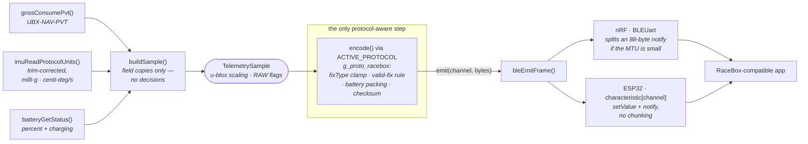

# Runtime path — one GNSS epoch

What happens each time the receiver produces a fix, from sensors to the app.
Companion to [`multiprotocol-design.md`](multiprotocol-design.md).

Driven by `telemetrySendIfReady()`, called every `loop()`. The work below runs
only when `gnssConsumePvt()` returns a new epoch **and** a BLE client is
connected.

## Why the split lands where it does

**`buildSample()` is deliberately boring.** It copies fields and makes no
judgements — `fixType` goes in raw, the validity booleans go in individually,
battery goes in as percent plus a charging flag rather than a packed byte. Every
interpretation happens one step later, inside the encoder.

That is not tidiness. `buildSample()` is the one link the host harness cannot
reach, because reconstructing a `UBX_NAV_PVT_data_t` would drag in the SparkFun
library. Keeping it trivial concentrates all the risk in `encode()`, which the
harness tests exhaustively. The copy itself is covered end-to-end instead, by
capturing from a real device and diffing against the pre-refactor reference.

**`encode()` emits rather than returns.** RaceBox sends one 88-byte frame, but
RaceChrono would send 20 bytes on its GPS characteristic and 3 more on GPS Time.
A sink handles one call producing N frames on different channels, with no
allocation — the buffer is stack-local and the call is synchronous.

**The transport split is real, not cosmetic.** `bleEmitFrame()` has the same
signature as `TelemetryEmit`, so it is handed straight to the encoder with no
adapter. Below it the two stacks genuinely differ: Bluefruit's `BLEUart` chunks
an oversized notify and manages TX backpressure, which is why the RaceBox path
was left on it rather than rebuilt. The ESP32 has no equivalent and does no
chunking: it starts each connection at MTU 23, follows the central's exchange
(a peripheral cannot start one), and refuses to send a frame that does not fit
rather than truncating it — so there, one channel builder serves
every protocol and `TransportKind` is ignored.

## What is not on this path

Cadence is one frame per GNSS epoch, so nothing here is timer-driven. The IMU
runs its own sampling and decimation in `g_imu`/`g_imu_trim` and this path only
reads the latest cached value. The serial stats line, the LED and the OLED all
observe state separately — the OLED uses `gnssLatestPvt()`, the non-consuming
reader, precisely so it cannot steal an epoch from this path.

## Concurrency — one model, one exception

**The firmware is cooperative-polled.** Every module is a `*Poll()` or
`*Update()` called from `loop()`, and everything on the path above runs there.
There are no interrupt handlers of ours (no `attachInterrupt`), no tasks we
create, no semaphores, no critical sections. Interrupts exist — the UART
receive ring, USB, the SoftDevice — but they live in the cores, and firmware
code consumes their results by polling, never by running inside them. That is
why `pvtCallback()` needs no `volatile`: the SparkFun library fires it from
`checkCallbacks()`, on the loop.

**The price is that loop latency is a correctness property.** Nothing may block
long enough to starve `gnssPoll()`. The budget is stated where the UART is
owned - since 2026-09-11 that is each `g_gnss_port_<mcu>.cpp`, not the shared
driver - and it is a different *kind* of constraint per MCU:
on the nRF52840 a 63-byte ring cannot hold one 100-byte NAV-PVT, so the loop
must drain *during* each message (a phase-sensitive 5.47 ms deadline); on the
ESP32 the ring holds 2.5 messages, leaving a duration budget of ~256 ms.

**The one exception is BLE stack callbacks** — the only code we own that runs
outside `loop()`, and the one thing the project does not schedule. Since
2026-09-13 they live only in the per-core ports behind `g_ble_port.h`; the
shared driver `g_ble.cpp` runs entirely on the loop apart from
`bleRxFromCallback()`, the one function a callback may call:

| stack | port | context | relation to `loop()` |
|---|---|---|---|
| nRF52840 (Bluefruit) | `g_ble_port_nrf52.cpp` | callback task | preemptive, single core |
| ESP32 (Bluedroid) | `g_ble_port_esp32.cpp` | BTC task | **different core, truly parallel** |

**Rules for callback code:**

1. **A lone flag may cross as a plain or `volatile` write** — provided it
   publishes nothing else.
2. **Anything a flag publishes needs `std::atomic` release/acquire.** `volatile`
   orders only other volatile accesses, and on ESP32 the reader is on another
   core. Write the data, *then* release-store the flag; the reader
   acquire-loads the flag, *then* reads the data.
3. **Inbound data goes through `bleRxFromCallback()`** into the driver's
   single-producer/consumer ring, never straight into shared state. That is what
   makes a protocol's `onWrite` a loop-thread call (see its contract in
   `g_protocol.h`).
4. **Do almost nothing, and never log.** The callback task also runs the stack.
   Connects and disconnects are logged by the driver, on the loop, when it
   notices the session count or the connected flag change.

**What crosses today, and the verdict on each:**

| state | writer → reader | verdict |
|---|---|---|
| `connected`, `sessionCount` (both ports) | connect / disconnect callbacks → loop | `std::atomic`; the count is what publishes a new session — rule 2 |
| `disconnectReason` (both ports) | disconnect callback → loop | `std::atomic`, stored **before** the flag clears, so the loop reads this disconnect's code — rule 2 |
| `peerMtu` (ESP32 port) | `onConnect` / `onMtuChanged` → loop | `std::atomic`, stored before the connection is published — rule 2 |
| RX ring indices | `bleRxFromCallback()` ↔ loop | `std::atomic`, release/acquire — rule 3 |
| `droppedWrites` | callbacks → loop | one writer; 32-bit aligned access is atomic on both MCUs — benign |
| serial logging | loop only | since the split no callback logs; before it, both contexts did, over mutex-guarded write paths |

An ESP32 row was wrong until 2026-09-10 (ARC-1): the flag was set *before* a
connection timestamp, with an `updatePeerMTU()` call between them, so the loop
on the other core could see "connected" beside the previous connection's
timestamp and skip the `BLE_CONNECT_SETTLE_MS` window. (That window and its
timestamp were deleted on 2026-09-13; since R3-2 the frames it delayed are
refused by the MTU check instead. The ordering rule stands, in the
`disconnectReason` and `peerMtu` rows.) It went unnoticed because nothing listed
what crosses — which is what this table is for. **Adding to a callback means
adding a row here.**

**Enforced, not just stated.** `src/tools/check_common.sh` fails if an
interrupt-attach, task-creation, semaphore, queue or critical-section call
appears in any firmware tree — so the first line of this section is a checked
fact rather than a claim.

## Timing measurements

The measurements behind the loop-latency constants. The source comments state
the constraint; this section records how the numbers were arrived at.

### GNSS UART rings

**nRF52840.** `Serial1` feeds a software ring one ENDRX interrupt at a time
(core `Uart.cpp`, `RingBuffer.cpp`). The ring is `SERIAL_BUFFER_SIZE` (64) bytes
with one slot reserved to tell full from empty, so 63 are usable — 5.47 ms at
115200 8N1. A NAV-PVT is 100 bytes (92 payload + 8 frame), 8.68 ms on the wire,
so the ring cannot hold one message; outside that window a 20 Hz stream leaves
~41 ms of clear air. Overflow is silent: `RingBuffer::store_char()` drops the
byte with no flag or counter.

`SERIAL_BUFFER_SIZE` is `#ifndef`-guarded in `RingBuffer.h`, but raising it with
`-D` is unsafe: it sizes a class member (`RingBuffer::_aucBuffer`, hence
`sizeof(Uart)`), so a flag that reached the sketch but not the prebuilt core
archive would leave the two disagreeing about object layout. The
`static_assert(SERIAL_BUFFER_SIZE < 100)` in `g_gnss_port_nrf52.cpp` flags a core
upgrade that changes it.

**ESP32.** The driver RX ring is set to 512 bytes (`kGnssRxRingBytes`; stock
256). It holds 2.5 messages, so phase stops mattering and the constraint is a
duration budget: at 2000 bytes/s, ~256 ms of stall (~128 ms stock). Wire time per
byte is the wrong frame here — bytes arrive as an 8.68 ms burst every 50 ms, not
back to back. `setRxBufferSize()` must precede the first `begin()`; afterwards it
only `log_e()`s and returns 0, which is why the result is checked. `end()` leaves
the size in place, so one call covers the baud sweep. More room is available the
same way (`tools/common/gnss_otp_clock` uses 1024).

### GNSS stall recovery

`gnssBegin()` writes the runtime configuration to RAM/BBR only, and the module's
backup supply holds BBR. Tested on the nRF52840-OLED (2026-09-13): the GNSS
connector unplugged for a few seconds and reseated came back at 20 Hz with a 3D
fix a second later, with no power cycle. An outage long enough to drain the
backup supply would leave the receiver at the right baud but with PVT output
off, silent until a power cycle re-runs bring-up — expected, but untested.

### Stats-line rate

The window closes on the MCU clock; the rate is measured epoch to epoch.
Dividing by the clock window made an epoch near a boundary count in whichever
window jitter chose: a perfect 20 Hz stream read as balanced 21/19 pairs, in
clusters, as the clocks drifted — the same signature as UART loss. A closing
edge on an epoch was also tried; it fixed the rate but moved the aliasing into
the RT counter. Full analysis: NEW-3 in
[`code-review-remediation.md`](code-review-remediation.md).

What remains is loop pickup jitter at each edge: about 1 window in 25 reads 19.9
or 20.1, while a lost epoch reads 19.0 or lower. `telemetryGnssRateHz()` keeps
the tenth (the harness asserts on it); the stats line and the OLED round to
whole numbers.

The stats line has a hard 255-byte ceiling on nRF. All fields at their type
maxima total 216 bytes; `test/telemetry`'s stats mode measures 210 at the
widest real values.

### ESP32 serial console

`HardwareSerial` constructs with no TX ring, so `uart_write_bytes()` blocks the
loop until the 128-byte hardware FIFO drains — about 20 ms for the stats line at
115200. That is 20 ms of not calling `gnssPoll()`; survivable against the stock
128 ms budget, but not headroom worth spending. `setTxBufferSize(512)` makes the
write queue instead. It must precede `Serial.begin()` and otherwise only
`log_e()`s and returns 0, so the result is checked and logged.

The boot wait is a flat `delay(700)`, not `while (!Serial)`. On a UART bridge
`operator bool()` is `uartIsDriverInstalled()`, true as soon as `begin()`
returns, so the poll waits zero while the bridge discards output until the host
opens the port. Measured loss window: ~200–400 ms with the module already at
`GNSS_BAUD`. Bytes sent while the host is still configuring the port arrive with
framing errors, which explained a block of garbage that used to precede the
banner (not the ROM bootloader's baud, as first assumed). The delay does not
cover the Arduino IDE's post-upload monitor reconnect.

On nRF, `Serial` is USB CDC: `write()` returns immediately with no host attached,
the 256-byte FIFO (`CFG_TUD_CDC_TX_BUFSIZE`, not overridable) takes a whole
line, and `operator bool()` tracks real host attachment, so the poll works there.

### BLE inbound write ring

Sized from the nRF `BLEUart` receive FIFO, 256 bytes
(`BLE_UART_DEFAULT_FIFO_DEPTH`): one drain can yield four 64-byte chunks. An
early, smaller ring lost the tail of a large drain, dropping 8 of 200 bytes.
Eight slots (seven usable) hold 448 bytes, past one full FIFO with slack for a
second drain; 512 bytes of RAM. `rxDispatchOne()` dispatches one write per loop
because the loop runs above 1000 Hz against one write per 15–30 ms connection
interval, so a burst still clears in microseconds while per-loop work stays
bounded.

### OLED push cost

The display bus runs at 400 kHz; u8g2 takes that from the SSD1306 descriptor and
calls `Wire.setClock()` before every transfer, which is why only the IMU's
`Wire1` needs `IMU_I2C_CLOCK_HZ`. A 1024-byte frame is ~23 ms of pure bus time;
`tools/nRF52840-OLED/oled_bench` measures ~31 ms, the difference being
addressing, command bytes, and the per-transfer `setClock()`.
`DISPLAY_FRAME_PUSH_MS` uses the measured figure; re-run the bench if the panel
or bus changes.

Total cost was never the problem — density was. Pushes on consecutive loop
passes leave the UART no clear stretch, and the GNSS rate sagged to a wandering
15–25 Hz with wider slices. Spacing slices `DISPLAY_SLICE_INTERVAL_MS` apart
(bench-validated 2026-08-05) helped, but evenly spaced pushes still landed on
the arriving message as often as not, more so as the SV count rose and the
receiver's emission point drifted later in the period. What fixed it was
phase-locking: pushing right after a NAV-PVT is parsed. Two slices is ~2 ms
against ~42 ms of clear air at 20 Hz (~32 ms at 25 Hz) and completes a frame in
16 epochs.

## See also

- [`architecture-modules.md`](architecture-modules.md) — what includes what, and the two forbidden edges
- [`architecture-verification.md`](architecture-verification.md) — how `encode()` is proven correct
