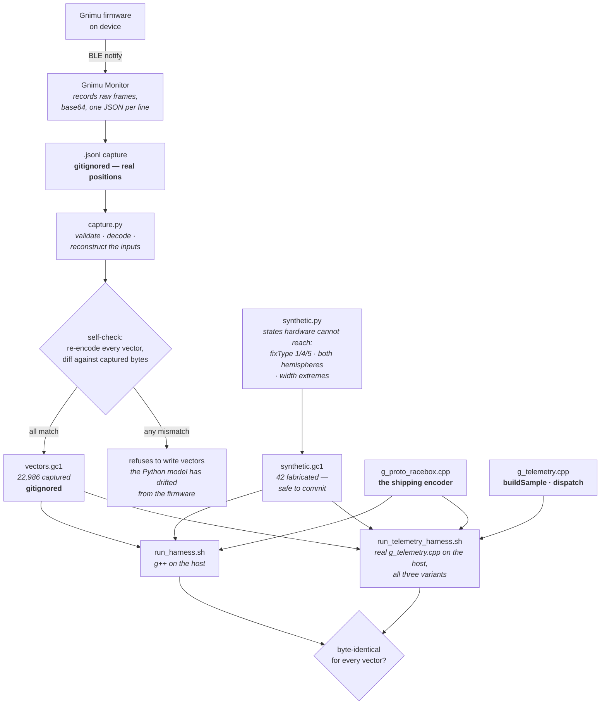

# Verification — how the encoder is proven correct

Build-time and test-time only; nothing here runs on the device. Companion to
[`multiprotocol-design.md`](multiprotocol-design.md) §11.

The problem this solves: `sendPacket()` had no test and no written spec, and the
refactor moved ~130 lines of field packing into a new module. "It still works"
had to become something measurable.



## Two encoders, and why that is not circular

There are two implementations of the RaceBox packet format, and keeping their
roles straight is the point:

| | What it is | Its job |
|---|---|---|
| `capture.py`'s `encode_packet()` | a **Python model** of the pre-refactor firmware | produce the vectors, then stop mattering |
| `g_proto_racebox.cpp` | the **C++ that ships** | be tested against them |

The obvious objection is that deriving expected outputs with one encoder and
testing another is circular. It is not, for two separate reasons.

**The reconstruction is independent.** `capture.py` decodes the packet from the
documented layout, not from the encoder under test. If the shipping encoder put
`hAcc` at the wrong offset, the reconstruction — reading the old, correct offset
— produces an input that re-encodes differently, and the diff catches it.

**The Python model was measured, not assumed.** It round-trips 22,986 real
packets captured from three variants, every one exactly. That measurement is
what promotes it from "a reading of the source" to a reference implementation,
and it is why generating the synthetic vectors with it is legitimate.

## What each layer catches

- **The self-check** (`capture.py`, on every run) catches drift between the
  Python model and reality. It refuses to write vectors when it fails.
- **The harness** catches a shipping encoder that disagrees with the vectors.
- **Synthetic vectors** catch what hardware cannot produce. The `fixType` clamp
  is the clearest case: 1 and 4 are unreachable on an M10, and all of 1/4/5 are
  clamped to 0 on the wire, so a capture cannot distinguish them. A broken clamp
  would pass all 22,986 captured vectors.
- **The telemetry harness** catches `buildSample()` copying the receiver's
  struct wrongly, and anything around it that stops the right frame going out.
  It compiles the real, unmodified `g_telemetry.cpp` against fakes of the
  modules it calls, fills the real `UBX_NAV_PVT_data_t` field by name from each
  vector, and compares the frame the real code emits. The same run checks the
  latch-once-per-epoch rule, the GNSS/BLE rate measurement (NEW-3), and the
  serial stats line. Proven able to fail: eight deliberate breakages of the real
  file, each caught (see ROB-6 part 2 in `code-review-remediation.md`).
- **The GNSS harness** catches a change to the receiver's bring-up: it runs the
  real `g_gnss.cpp` against a fake receiver that answers only at its own baud,
  and the golden is the ORDERED LOG of every port and library call with its
  arguments - so the baud sweep, the configuration sequence and ROB-1's
  non-halting failure path are covered on the host for the first time. Serial
  wording is deliberately not captured. Proven able to fail: five breakages of
  the real file, each caught.
- **A fresh capture after flashing** still covers what no host run can: the
  SparkFun library filling that struct from UART bytes, and the BLE transport.

## Known blind spots

The SparkFun library's parsing of UART bytes into `UBX_NAV_PVT_data_t` is
vendor code and is not exercised on the host; the telemetry harness starts from
the filled struct. `buildSample()` used to be the blind spot here, covered only
by capture-and-diff; it is now covered by the telemetry harness.

The battery percent clamp (`> 100 → 100`) cannot be expressed as a vector: a
GC1 line carries the *packed* byte, which can only ever show the already-clamped
value. `synthetic.py` rejects any battery byte implying percent above 100 so the
limitation cannot be forgotten. The clamp is unreachable anyway —
`voltageToPercent()` caps at 100 — and is covered by inspection.

## Running it

```bash
./test/run_harness.sh              # the encoder alone
./test/run_telemetry_harness.sh    # the real telemetry path, all three variants
./test/run_gnss_harness.sh         # the real GNSS driver against a fake receiver
./test/run_imu_harness.sh          # the real IMU pipeline against fake sensors
```

On a fresh clone this runs against `synthetic.gc1` alone (42 vectors), because
captures and their derived vectors are gitignored — they contain real GNSS
positions at full resolution, and committing them would publish wherever the
capture was taken. Regenerate locally:

```bash
./test/capture.py test/<capture>.jsonl -o test/vectors.gc1
```

If a captured fixture is ever wanted in-repo, sanitize rather than un-ignore:
offset the coordinates and re-encode through `encode_packet()`, which keeps
checksums and derived flags self-consistent.

## See also

- [`architecture-modules.md`](architecture-modules.md) — why the encoder can be compiled on a host at all
- [`architecture-runtime.md`](architecture-runtime.md) — where `encode()` sits at runtime
