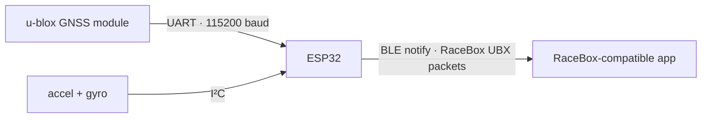

# Gnimu: GNSS+IMU data over BLE

[-00599C.svg)](https://www.arduino.cc/)

This repository holds the ESP32-based version of Gnimu. This was the first variant that I built, and this version is my recommended starting point for someone who wants a cheap, simple, effective, easy-to-build DIY GNSS+IMU device to stream telemetry data to a compatible app. The single drawback is the requirement that it always be connected to USB power.

> [!IMPORTANT]
> **Unofficial project.** This is an independent, educational, and non-commercial implementation. It is **not affiliated with, endorsed by, or supported by RaceBox.** "RaceBox" and related marks belong to their respective owner. Use this code for learning and personal purposes only, and at your own risk. Do not use this code to impersonate a genuine device for any commercial or fraudulent purpose.

---

## Logical design

---

## Hardware

<table>
  <tr>
    <th width="28%" align="left">Part</th>
    <th align="left">Notes</th>
  </tr>
  <tr>
    <td><a href="https://www.amazon.com/dp/B0DF2YJSHN"><strong>ESP32 dev board</strong></a></td>
    <td>Developed on an AITRIP ESP32-WROOM-32 Development Board.</td>
  </tr>
  <tr>
    <td><a href="https://www.amazon.com/dp/B0CB5N8RQ8"><strong>u-blox GNSS module</strong></a></td>
    <td>A u-blox <a href="https://www.u-blox.com/en/product/max-m10-series">M10-class</a> GNSS receiver. Reference unit: <a href="https://www.hglrc.com/products/m100-5883-gps">HGLRC M100-5883</a>. Other u-blox modules supported by the SparkFun library should work.</td>
  </tr>
  <tr>
    <td><a href="https://www.amazon.com/dp/B01DK83ZYQ"><strong>IMU module</strong></a></td>
    <td>I²C 6-axis accelerometer + gyroscope breakout. Reference unit: <a href="http://www.hiletgo.com/ProductDetail/2157948.html">HiLetgo GY-521</a> based on the <a href="https://invensense.tdk.com/products/motion-tracking/6-axis/mpu-6050/">InvenSense MPU-6050</a>.</td>
  </tr>
  <tr>
    <td><a href="https://www.amazon.com/dp/B0BQYPKRQS"><strong>Project Box</strong></a></td>
    <td>ABS plastic project case, white, 80x50x26mm. You'll need to cut holes into this box to fit your specific board and component layout (see images below).</td>
  </tr>
  <tr>
    <td><a href="https://www.amazon.com/dp/B0FPMC9917"><strong>Nylon M2.5 hex standoffs</strong></a></td>
    <td>Nylon hex standoffs, washers, nuts, screws, to help with positioning the components within the project box.</td>
  </tr>
</table>

### Wiring

**GNSS module → ESP32 (UART, Serial2)**

| GNSS pin | ESP32 pin |
|----------|-----------|
| TX       | GPIO16 (RX2) |
| RX       | GPIO17 (TX2) |
| VCC      | 3V3 |
| GND      | GND |

**IMU module → ESP32 (I²C)**

| IMU pin | ESP32 pin |
|-------------|-----------|
| SDA         | GPIO21 (default I²C SDA) |
| SCL         | GPIO22 (default I²C SCL) |
| VCC         | VIN (5V pin) |
| GND         | GND |

**Status LED:** the onboard LED (GPIO2) blinks while waiting for a BLE connection and stays solid when a client is connected.

> Pin assignments for the GNSS UART and the LED are configurable in [`config.h`](config.h). The IMU uses the ESP32's default I²C pins.

---

## Build gallery

Photos of the reference build, from loose components to the finished, enclosed unit. Several shots show an **RF shield** fitted over the electronics — a hardware counterpart to the firmware's reduced BLE power that further isolates the GNSS receiver from radio noise (see [GNSS module considerations](../../README.md#gnss-module-considerations)).

   
  The completed emulator, decorated with the stickers that came with the GNSS module and an indicator of which end points forward (for Gyro/Accelerometer). &nbsp;

<table>
  <tr>
    <td align="center" valign="top" width="50%">
       
      Components and enclosure prior to assembly. &nbsp;
    </td>
    <td align="center" valign="top" width="50%">
       
      GNSS module with mounting hole in the lid. &nbsp;
    </td>
  </tr>
  <tr>
    <td align="center" valign="top" width="50%">
       
      Components wired together, using header pins underneath the ESP32 board. Extra unused pins were clipped off. &nbsp;
    </td>
    <td align="center" valign="top" width="50%">
       
      Assembled, using hardening epoxy putty to firmly affix the components.
    </td>
  </tr>
  <tr>
    <td align="center" valign="top" width="50%">
       
      RF shield test fit, not yet grounded or affixed. &nbsp;
    </td>
    <td align="center" valign="top" width="50%">
       
      RF shield grounded; I used two-sided tape to mount the shield. &nbsp;
    </td>
  </tr>
  <tr>
    <td align="center" valign="top" width="50%">
       
      Enclosure closed up, ready to test (before stickers!). &nbsp;
    </td>
    <td align="center" valign="top" width="50%">
       
      Connected to power, LEDs lit up. &nbsp;
    </td>
  </tr>
</table>

---

## Software & dependencies

The IDE, the GNSS library and the general build steps are in the [main README's Building section](../../README.md#building). This variant also needs:

- **ESP32 board support** — install the `esp32` package by Espressif via the Boards Manager.
- **Adafruit MPU6050**, via Library Manager (pulls in Adafruit Unified Sensor + Adafruit BusIO).
- BLE support is built into the ESP32 Arduino core — no extra install needed.

---

## Build & flash

Follow the [main README's build steps](../../README.md#building), opening [`Gnimu-ESP32.ino`](Gnimu-ESP32.ino) and selecting **ESP32 Dev Module** (or your specific board).

---

## Configuration

Settings live in [`config.h`](config.h). Those shared by every Gnimu build are described in the [main README's Configuration section](../../README.md#configuration); these are specific to this hardware:

| Setting | Purpose |
|---------|---------|
| `GNSS_RX_PIN`, `GNSS_TX_PIN`, `LED_ONBOARD_PIN` | Hardware pin assignments. |
| `IMU_ENABLED` | `1` if an MPU-6050 is fitted, `0` to build without one. With `0` the IMU fields read zero, trim never runs, and the Adafruit MPU6050 library isn't needed to build. GNSS, BLE and lap timing are unaffected. |
| `IMU_I2C_ADDRESS` | The MPU-6050's I2C address: `0x68` with its AD0 pin low (the usual breakout default), `0x69` with AD0 high. Pointing it at the wrong one is also a safe way to rehearse a missing IMU: the device logs `❌ IMU not found` and carries on. |
| `IMU_ACCEL_RANGE_G`, `IMU_GYRO_RANGE_DPS`, `IMU_FILTER_BANDWIDTH_HZ` | MPU-6050 full-scale ranges and built-in low-pass bandwidth (Adafruit MPU6050 enum tokens). |
| `BLE_TX_POWER` | BLE transmit power. **Lowering this reduces RF interference with the GNSS front end and can noticeably improve satellite lock** — see [GNSS module considerations](../../README.md#gnss-module-considerations). |

---

## Usage

Follow the [main README's Connecting steps](../../README.md#connecting). The onboard LED blinks while waiting for a connection and goes solid once a client connects.

---

## Troubleshooting

See the [main README's Troubleshooting table](../../README.md#troubleshooting) for symptoms common to every build. Specific to this hardware:

| Symptom | Things to check |
|---------|-----------------|
| `❌ IMU not found` | I²C wiring (SDA/SCL), VIN (5V) power, `IMU_I2C_ADDRESS`. |
