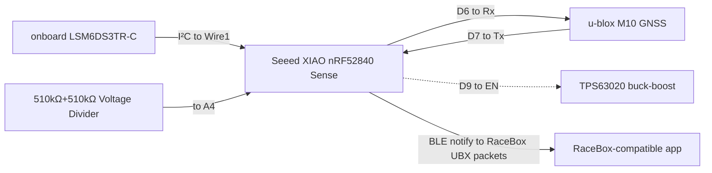

# Gnimu: GNSS+IMU data over BLE

[![License: GPL v3][License-shield]][License-link]
[![Platform: nRF52840][Platform-shield]][Platform-link]
[![Language: C++ (Arduino)][Language-shield]][Language-link]

This section of the repository is a **battery-powered** evolution of [Gnimu][0], re-targeted from the original always-on ESP32-based build to a **Seeed Studio XIAO nRF52840 Sense** [MCU][9] (MicroController Unit). This version runs off a **3.7V LiPo battery** instead of a USB supply, uses the XIAO's **onboard 6-axis IMU**, and adds a full battery subsystem (charge detection, state-of-charge reporting, and a firmware low-voltage cutoff).

The advertised BLE identity and data streaming protocol stay exactly the same for RaceBox Mini app compatibility. The two streaming data changes compared to the ESP32-based version are actual battery charge percentage value (rather than reporting a fixed 100%), and charging status.

> [!IMPORTANT]
> **Unofficial project.** This is an independent, educational, and non-commercial implementation. It is **not affiliated with, endorsed by, or supported by RaceBox.** "RaceBox" and related marks belong to their respective owner. Use this code for learning and personal purposes only, and at your own risk. Do not use this code to impersonate a genuine device for any commercial or fraudulent purpose.

---

## What's different about this variant

- Reads acceleration and rotation from the **XIAO's onboard 6-axis IMU (LSM6DS3TR-C)** instead of an external MPU-6050 module.
- **Runs on battery.** Reads its own LiPo voltage, reports state-of-charge and charging status in the RaceBox protocol's battery byte, and enforces a **firmware low-voltage cutoff** to protect the cell rather than rely on the presence of over-discharge protection circuitry in the LiPo (most LiPos do have over-discharge protection, so this is belt-and-braces).
- **Switches itself off when forgotten.** After `STATE_IDLE_TIMEOUT_MIN` (4h by default) on battery with no app subscribed to its data, it drops to deep sleep (System OFF). A slide-switch cycle or a USB plug-in brings it back.

---

## Hardware

<table>
  <tr>
    <th width="30%" align="left">Part</th>
    <th align="left">Notes</th>
  </tr>
  <tr>
    <td>
        <a href="https://www.amazon.com/dp/B0DRNTLCWC"><strong>Seeed XIAO nRF52840 Sense</strong></a>
    </td>
    <td>
        The heart of the build: nRF52840 BLE SoC + onboard 6-axis LSM6DS3TR-C IMU + onboard LiPo charging, in a 21×18 mm footprint. Uses the mature Nordic/Adafruit Bluefruit BLE stack. More details at <a href="https://wiki.seeedstudio.com/XIAO_BLE/">the Seeed Studio Wiki</a>
    </td>
  </tr>
  <tr>
    <td><a href="https://www.amazon.com/dp/B0CB5N8RQ8"><strong>u-blox GNSS module</strong></a></td>
    <td>A u-blox M10-class GNSS receiver. The compass pins are unused.</td>
  </tr>
  <tr>
    <td>
        <strong><a href="https://www.amazon.com/dp/B0D8T3J8QZ">TPS63020 buck-boost regulator</a></strong>
    </td>
    <td>
        Supplies the GNSS a stable 3.3V rail across the full LiPo output range. Output-select set to 3.3V; PS pad shorted for forced-<a href="https://en.wikipedia.org/wiki/Pulse-width_modulation">PWM</a> (cleaner 3.3V output); EN pad broken out to the XIAO as the GNSS power gate.
    </td>
  </tr>
  <tr>
    <td>
        <strong><a href="https://www.amazon.com/dp/B0FR9LK28P">3.7V LiPo battery</a></strong>
    </td>
    <td>
        Flat pouch cell, 900mAh. Lands on the XIAO's BAT± pads. PCM protection circuit built-in for safety features including overcharge, over-discharge, overcurrent, and short-circuit protection. The firmware implements low-voltage cutoff logic as an additional protection against over-discharge.
    </td>
  </tr>
  <tr>
    <td>
        <strong><a href="https://www.amazon.com/dp/B0BWMS64PR">Latching 1P2T switch</a></strong>
    </td>
    <td>
        Switch inline on battery positive lead for full power disconnect. Slide to OFF position to store the unit between uses to preserve charge. Must be ON to charge the battery.
    </td>
  </tr>
  <tr>
    <td>
        <strong>
            <a href="https://www.amazon.com/dp/B08SC3F658">JST PH2.0 leads</a><br><br>
            <a href="https://www.amazon.com/dp/B0B2D8R9CX">JST 1.25 leads</a>
        </strong>
    </td>
    <td>
        JST PH2.0 and 1.25 male and female connector leads. Used for the connections to the LiPo, switch, TPS VIN/GND and XIOA BAT± pads.
    </td>
  </tr>
  <tr>
    <td>
        <strong><a href="https://www.amazon.com/dp/B08QRGJF5G">Resistors</a></strong>
    </td>
    <td>
        510kΩ resistors used in the voltage divider that supplies a signal for the power switch on/off sense controller.
    </td>
  </tr>
  <tr>
    <td>
        <strong><a href="https://www.amazon.com/dp/B0CNGJTKNK">USB-C right-angle adapter</a></strong>
    </td>
    <td>
        USB-C right-angle adapter used to help mount the XIAO in the project box. The adapter and XIAO module are affixed to the project box's lid and held in place with hardening putty. The socket of the adapter is exposed on the side of the project box. I took this approach as the XIAO does not have integrated standoff mounting holes, and I wanted to be able to mount the module in a way to both expose the USB-C port as well as keep the reset button and module LED close enough to a surface of the box to be useful.
    </td>
  <tr>
    <td>
        <strong><a href="https://www.amazon.com/dp/B0BQYPKRQS">Project box</a></strong>
    </td>
    <td>
        ABS plastic enclosure, 45mm × 75mm × 20mm. Openings are cut into the case to expose the GNSS antenna patch, GNSS indicator LEDs, XIAO reset button, XIAO LEDs, and the XIAO USB-C connector (for charging and firmware flash).
    </td>
  </tr>

</table>

---

## Wiring

### Logic Topology


### Signal connections

| From XIAO | To | Notes |
|---|---|---|
| **D6** (Serial1 TX) | GNSS **RX** | UART TX↔RX crossover |
| **D7** (Serial1 RX) | GNSS **TX** | UART TX↔RX crossover |
| **D9** | TPS63020 **EN** | GNSS power gate |
| **A4** | Switch-sense divider tap | Slide switch's spare pole through a 510kΩ / 510kΩ divider to ground; reads ~2V when OFF, ~0V when ON |

- The GNSS **SDA / SCL** (compass) pins are left unconnected as the firmware doesn't use them.
- **IMU** is onboard the XIAO and requires no wiring.
- **RGB LED** is onboard the XIAO.
- **Battery sense / charging** is onboard the XIAO (internal VBAT divider and USB-C charger).
- Pin assignments are documented and adjustable in [`config.h`][config]

### Power topology

The XIAO runs directly off the LiPo (its onboard charger/LDO intact); the buck-boost gives the GNSS a clean 3.3V rail. All four GND pins on the TPS63020 are a continuous bus.

```
        (+) ───┬─[ switch pos1 ]──┬─────────► XIAO BAT+
  LiPo         │                  └─────────► TPS63020 VIN
  3.7V         └─[ switch pos2 ]────────────► Voltage Divider Input
        (–) ────────────────────────────┬───► XIAO BAT-
                                        ├───► TPS63020 GND
                                        ├───► GNSS GND
                                        └───► Voltage Divider GND

  TPS63020 OUT (3.3V) ──────────────────────► GNSS VCC
  Voltage Divider OUT ──────────────────────► XIAO A4
```

## Build gallery

Photos of the reference build.

<table>
  <tr>
    <td align="center" valign="top" width="50%">
      <br>
      <sub>Components before assembly.</sub><br>&nbsp;
    </td>
    <td align="center" valign="top" width="50%">
      <br>
      <sub>TPS63020 buck-boost wired to the battery and GNSS.</sub><br>&nbsp;
    </td>
  </tr>
  <tr>
    <td align="center" valign="top" width="50%">
      <br>
      <sub>Bench testing on a breadboard.</sub><br>&nbsp;
    </td>
    <td>
        <br>
        <sub>Components wired and installed in case, held firm by hardening putty.</sub><br>&nbsp;
    </td>
  </tr>
  <tr>
    <td align="center" valign="top" width="50%">
      <br>
      <sub>The completed device, powered on and showing USB port.</sub><br>&nbsp;
    </td>
    <td align="center" valign="top" width="50%">
      <br>
      <sub>The completed device, powered on and showing slide switch.</sub><br>&nbsp;
    </td>
  </tr>
</table>

---

## Software & dependencies

The IDE, the GNSS library and the general build steps are in the [main README's Building section](../../README.md#building). This variant also needs:

- **Board support — "Seeed nRF52 Boards"** (the **non-mbed**, Adafruit-nRF52-based core; **do not use** "Seeed nRF52 mbed-enabled Boards", which lacks Bluefruit). Add this Boards Manager URL, then install the package:
  ```
  https://files.seeedstudio.com/arduino/package_seeeduino_boards_index.json
  ```
- **Seeed Arduino LSM6DS3** (onboard IMU), via Library Manager.

> [!IMPORTANT]
> **macOS build gotcha:** The Seeed nRF52 core's `platform.txt` invokes bare `python` for its UF2 step, but modern macOS only ships `python3`, so compiling fails with `exec: "python": executable file not found in $PATH`.
>
> **Fix:** in `~/Library/Arduino15/packages/Seeeduino/hardware/nrf52/<version>/platform.txt`, change `python` to `python3` on the `recipe.objcopy.uf2.pattern` line. (note: this reverts on every core reinstall/update, so it must be re-done afterward)

---

## Build & flash

Follow the [main README's build steps](../../README.md#building), opening [`Gnimu-nRF52840.ino`][5] and selecting **Seeed XIAO nRF52840 Sense** as the board. If the upload can't reset into the bootloader (common with BLE/SoftDevice sketches), **double-tap the reset button on the XIAO** to force it, then upload again.

---

## Configuration

Settings live in [`config.h`][config]. Those shared by every Gnimu build are described in the [main README's Configuration section](../../README.md#configuration); these are specific to this hardware:

| Setting | Purpose |
|---|---|
| `GNSS_EN_PIN` | GNSS power-gate pin (`D9`) wired to the TPS63020 EN pad. |
| `GNSS_BAUD` | The shared behavior is in the main README. Specific to this board: lower rates widen the window `gnssPoll()` has to drain the ~64-byte UART RX buffer — see the rate table in [`config.h`][config]. |
| `IMU_ACCEL_RANGE_G`, `IMU_GYRO_RANGE_DPS`, `IMU_*_ODR_HZ` | LSM6DS3 full-scale ranges and output data rates, as plain integers. The rates are validated against the list the Seeed library actually maps (13–833, 1660, plus 3330/6660 for the accel) — anything else silently becomes 104 Hz. The driver reads all of it back at boot and refuses to come up if the chip did not take it. |
| `IMU_ACCEL_LPF1_ODR_DIV` | The accelerometer's digital low-pass filter (LPF1), as the ODR divider the part implements: `2` or `4`. At 104 Hz that is 52 Hz or 26 Hz; the shipped `4` gives 26 Hz. It replaced `IMU_ACCEL_BANDWIDTH_HZ`, which was wrong in name and value: the Seeed library targets the original LSM6DS3, where those register bits are an analog anti-alias filter, while the TR-C fitted here splits them into an analog bit (inert below 1.67 kHz) and this divider. A compile-time check rejects any combination whose cutoff would alias against the rate `imuPoll()` reads at. |
| `IMU_ENABLED` | Set automatically from the board selected in the IDE: `1` for the XIAO nRF52840 Sense (which has the onboard IMU), `0` for the plain XIAO nRF52840. With `0` the IMU fields read zero, trim never runs, and the Seeed LSM6DS3 library isn't needed to build. To override, replace the block with a plain `#define`. |
| `BLE_TX_POWER_ADV_DBM`, `BLE_TX_POWER_CONN_DBM` | BLE transmit power in **dBm** while advertising vs connected (both default `-16`). **Lower = quieter radio = better GNSS lock** — see [GNSS module considerations](../../README.md#gnss-module-considerations). |
| `BATTERY_CUTOFF_V`, `BATTERY_WARN_V`, `BATTERY_CRITICAL_V`, `BATTERY_FULL_V`, `BATTERY_DISCHARGE_CURVE`, `BATTERY_FAST_CHARGE` | Low-voltage cutoff, amber-warn and red-critical LED thresholds, "fully charged" LED threshold, the LiPo voltage→percent curve, and fast-charge select. |
| `BATTERY_POLL_INTERVAL_MS`, `BATTERY_SAMPLE_COUNT`, `BATTERY_SAMPLE_SPACING_US`, `SAADC_TACQ_US`, `BATTERY_EMA_ALPHA` | Non-blocking VBAT sampler cadence, samples per run, pacing between reads, the SAADC acquisition-time setting (40 µs is required for the XIAO's ~338 kΩ VBAT divider and the ~255 kΩ switch-sense divider), and the display-voltage smoothing factor. |
| `POWER_SWITCH_SENSE_PIN`, `POWER_SWITCH_OFF_THRESHOLD_MV` | Slide-switch position sense (`A4` divider) — reads > threshold = switch OFF = BATTERY_WAIT. |
| `STATE_CHARGE_ONLY_ON_USB` | `1` (default) auto-enters CHARGE_ONLY on USB plug-in so the charger can top the cell up at full current; `0` stays in RUNNING while plugged in (for bench development). |
| `STATE_IDLE_TIMEOUT_MIN` | Minutes on battery with no BLE client **subscribed** (a bare connection does not count) before RUNNING → DEEP_SLEEP. Default 240 (4 h). The clock stands still on USB power. |
| `LED_BATTERY_WAIT_BLINK_MS`, `LED_BLINK_INTERVAL_MS` | Rapid-red blink half-period for BATTERY_WAIT; standard blink half-period for the other states. |
| `LOG_ENABLED` | The shared behavior is in the main README. Specific to this board: `0` also compiles out `Serial.begin()` and the 3 s USB-CDC enumeration wait in `setup()`, so a silent build boots straight through without waiting on a host that will never open the port. Turn logging off for production firmware where you don't need diagnostics, as it slightly decreases loop latency to ensure rock-solid 25Hz operation. |

---

## Battery & power

- The XIAO runs directly off the **LiPo** and charges it over **USB-C**. A **slide switch** gives a full battery disconnect for storage.
- The firmware reads the LiPo voltage, maps it to a percentage via the discharge curve defined in `config.h`, detects charging from USB/VBUS, and writes both into the **RaceBox protocol battery byte** (offset 67: charging bit + percent).
- A **state machine** orchestrates power behavior across four operating states: normal **RUNNING**; **CHARGE_ONLY** while plugged in (peripherals held off so the charger gets max current to the cell); a switch-off **BATTERY_WAIT** idle; and **DEEP_SLEEP** (System OFF) on the low-battery cutoff or after `STATE_IDLE_TIMEOUT_MIN` on battery with no app subscribed.
- The firmware enforces a **low-voltage cutoff**. On a sustained VBAT drop below `BATTERY_CUTOFF_V` while running on the LiPo (not while charging), the firmware cleanly stops BLE, cuts the GNSS rail, powers the IMU down, and puts the nRF52840 into System OFF deep sleep to prevent LiPo over-discharge. Recovery is a USB plug-in or a slide-switch off→on cycle (though if the battery is not recharged before a power cycle, it will power down again).
- **Plugging in USB with the switch ON auto-enters CHARGE_ONLY** — the LED continues to signal charging (green blink → solid green when full) but GNSS/IMU are held off and BLE stops advertising, so all available current goes to charging. Unplug USB or flip the switch off to leave the state (both trigger a reset back through the boot classifier). If you want the device to keep streaming/serving BLE while plugged in, set `STATE_CHARGE_ONLY_ON_USB` to `0` in `config.h`.
- **With the switch OFF and USB plugged in, the device is in BATTERY_WAIT** — the LED blinks **rapid red** as a "check the switch" signal and no peripherals are powered up. Flipping the switch back on resets the device into normal operation. Without the switch on, no charging occurs (the switch is inline with the battery+ path). Switch position is detected via a hardware switch-sense line. The slide switch's spare throw feeds a 510kΩ / 510kΩ divider to pin `A4`, giving a load- and SoC-independent signal that survives while the device is actively streaming.

### Estimated runtime (900 mAh cell)

| Scenario | Estimate |
|---|---|
| Continuous RUNNING (BLE connected, GNSS fixing, streaming) | **16+ hours** |
| Switch ON, unplugged (no app subscribed) | **4h at RUNNING draw**, then self-suspends to DEEP_SLEEP: **months++** |
| Switch OFF, unplugged | **Years** — standby loss is dominated by the battery's own self-discharge, not the firmware or circuit. |

---

## Usage

1. Charge the LiPo (plug in USB-C, set switch ON) before disconnected use.
2. Disconnected from USB, slide switch to ON. The LED **blinks blue** while advertising and waiting for a receiver.
3. Connect from your app following the [main README's Connecting steps](../../README.md#connecting). On connect, the LED turns **solid blue**.

### Gnimu status LED

The XIAO's onboard RGB LED signals state:

| Color | Meaning |
|---|---|
| 🟢 Green (blinking) | Charging (USB connected). |
| 🟢 Green (steady) | Fully charged (USB connected). |
| 🟡 Amber (blinking) | Low battery — warning (at or below `BATTERY_WARN_V`, 3.60 V). |
| 🔴 Red (blinking) | Low battery — critical (at or below `BATTERY_CRITICAL_V`, 3.40 V). |
| 🔴 Red (rapid blink) | **BATTERY_WAIT** — switch is OFF. Switch ON to charge. |
| 🔵 Blue (steady) | BLE client connected. |
| 🔵 Blue (blinking) | BLE advertising, waiting for a connection. |

## Troubleshooting

See the [main README's Troubleshooting table](../../README.md#troubleshooting) for symptoms common to every build. Specific to this hardware:

| Symptom | Things to check |
|---|---|
| LED blinks **rapid red** and nothing else works | The slide switch is **OFF** while USB is connected — the device is in BATTERY_WAIT (see [Battery & power](#battery--power)). Flip the switch on with a battery connected to boot normally. |
| Device is plugged in + switch ON but doesn't appear in BLE scans / won't accept a connection | With default settings (`STATE_CHARGE_ONLY_ON_USB = 1`) plugging in auto-enters CHARGE_ONLY — BLE is disconnected and advertising is stopped so the charger can top the cell up at full current. Unplug USB to return to RUNNING. If you need BLE while plugged in (bench development), set `STATE_CHARGE_ONLY_ON_USB = 0` in `config.h` and reflash. |
| Device does nothing at all (no LED, no serial activity) when plugged into USB | Check that a charged battery is actually connected — the slide switch alone doesn't power the MCU from USB unless VBUS is also present. Confirm the USB cable/port carries data, not just power. |
| `❌ IMU not found` | Confirm that you have a **"Sense"** XIAO (the plain XIAO has no IMU); reflash. |
| `❌ u-blox GNSS not detected` | Beyond the checks in the main README: measure the TPS63020's 3.3V output, and confirm its EN pin is being driven high. |
| `exec: "python"` compile error (macOS) | Apply the `python`→`python3` `platform.txt` fix (see [Software & dependencies](#software--dependencies)). |
| Upload won't start | Double-tap the reset button to force the bootloader, reselect the port, upload again. |

---

## Diagnostic sketches

[`src/tools/nRF52840/`](../tools/nRF52840/README.md) holds small standalone sketches for bringing up this board's subsystems in isolation — IMU, LED, BLE MTU, GNSS power gating, battery sensing and logging, flash storage. Its README has pass criteria for each and what each result fed back into the firmware.

The GNSS sketches in [`src/tools/common/`](../tools/common/) — `gnss_ver` (identity and high-rate capability report), `gnss_otp_clock` (the **permanent** M10 high-performance clock burn) and `gnss_reset` (factory reset) — build for every variant. They're listed in [`src/README.md`](../README.md#inside-tools), and each sketch's header comment explains exactly what it reads and writes.

[License-shield]: https://img.shields.io/badge/License-GPLv3-blue.svg
[Platform-shield]: https://img.shields.io/badge/platform-nRF52840-00A9CE.svg
[Language-shield]: https://img.shields.io/badge/language-C%2B%2B%20(Arduino)-00599C.svg
[License-link]: ../../LICENSE
[Platform-link]: https://wiki.seeedstudio.com/XIAO_BLE/
[Language-link]: https://www.arduino.cc/
[config]: ./config.h

[0]: ../Gnimu-ESP32/README.md
[5]: ./Gnimu-nRF52840.ino
[9]: https://en.wikipedia.org/wiki/Microcontroller
