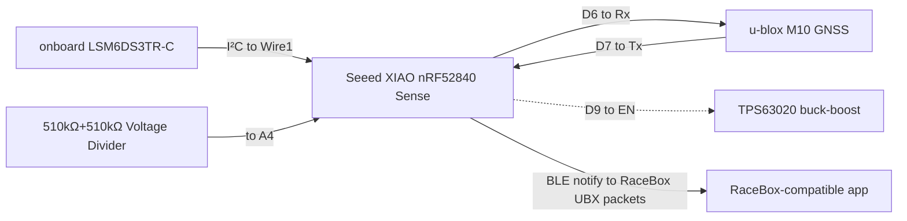
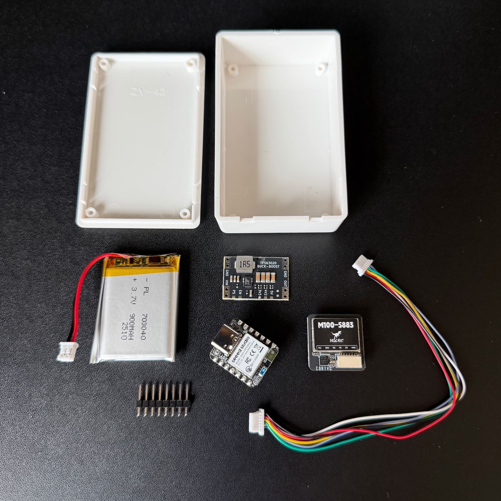
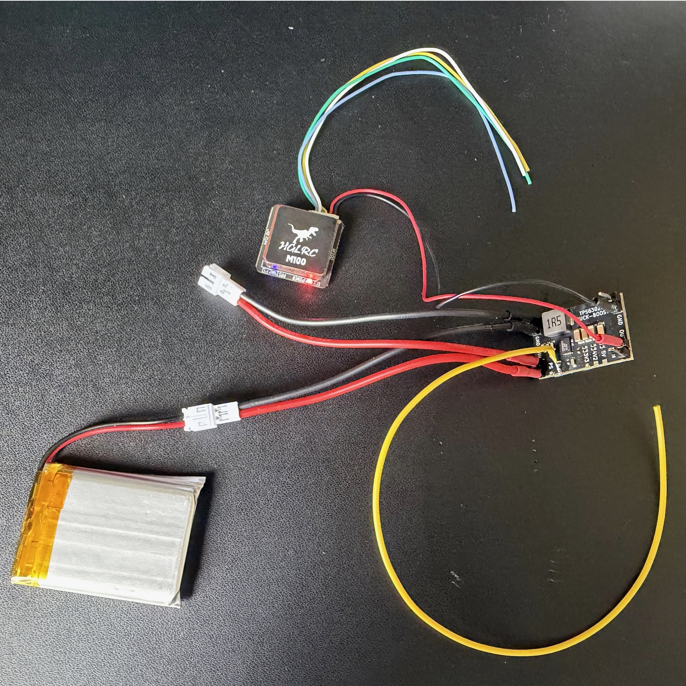
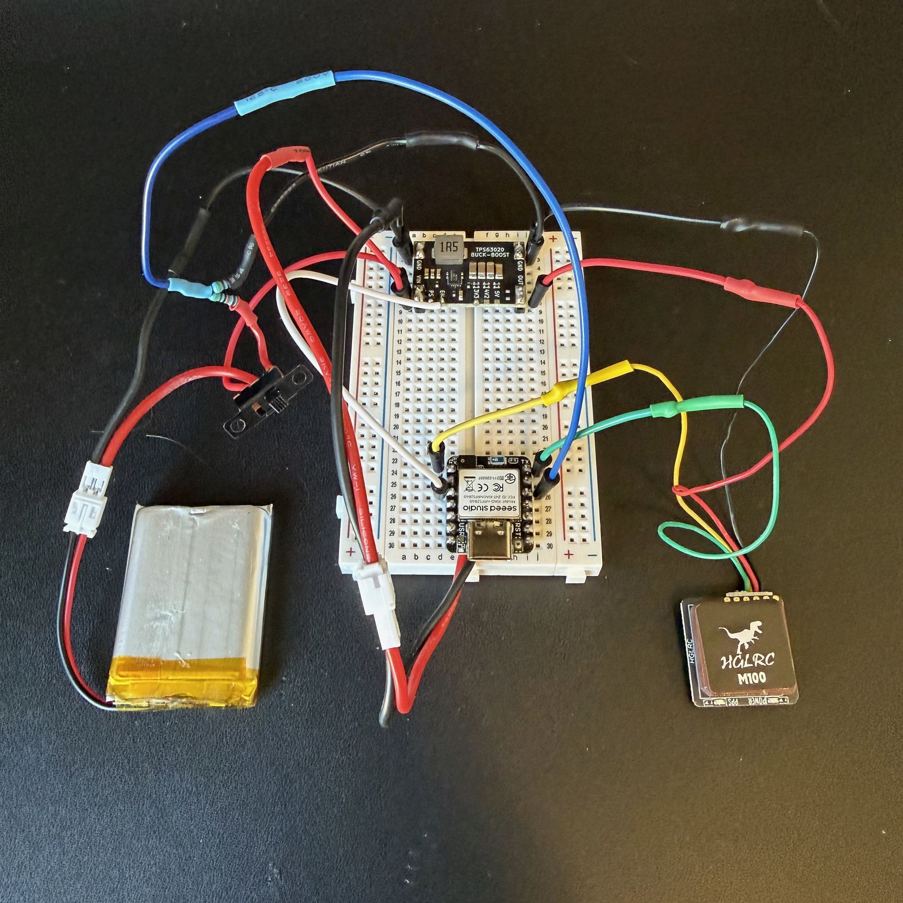
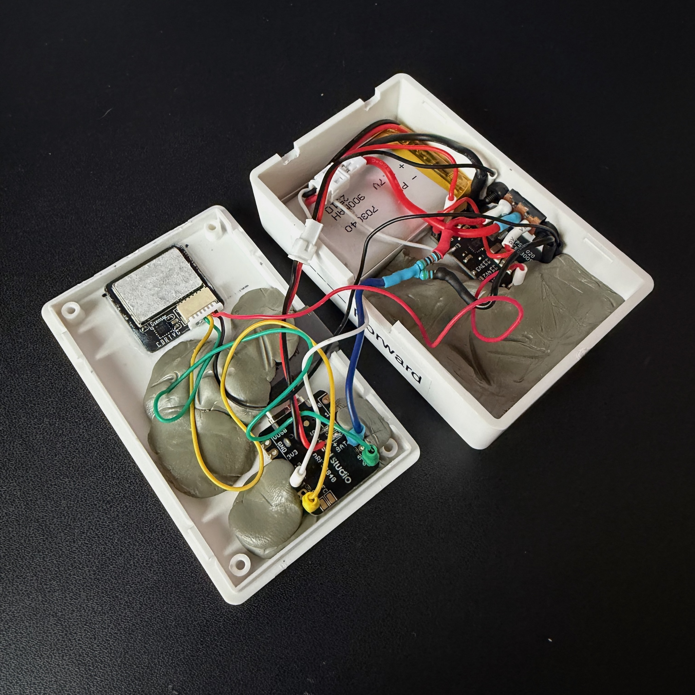
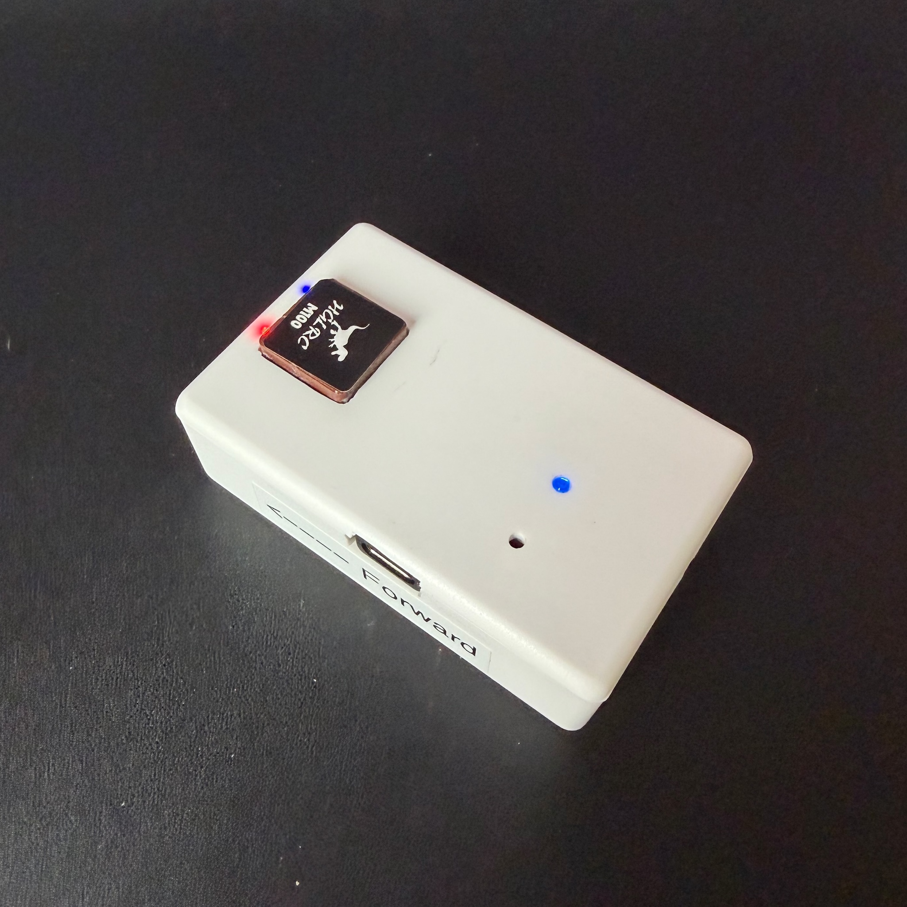
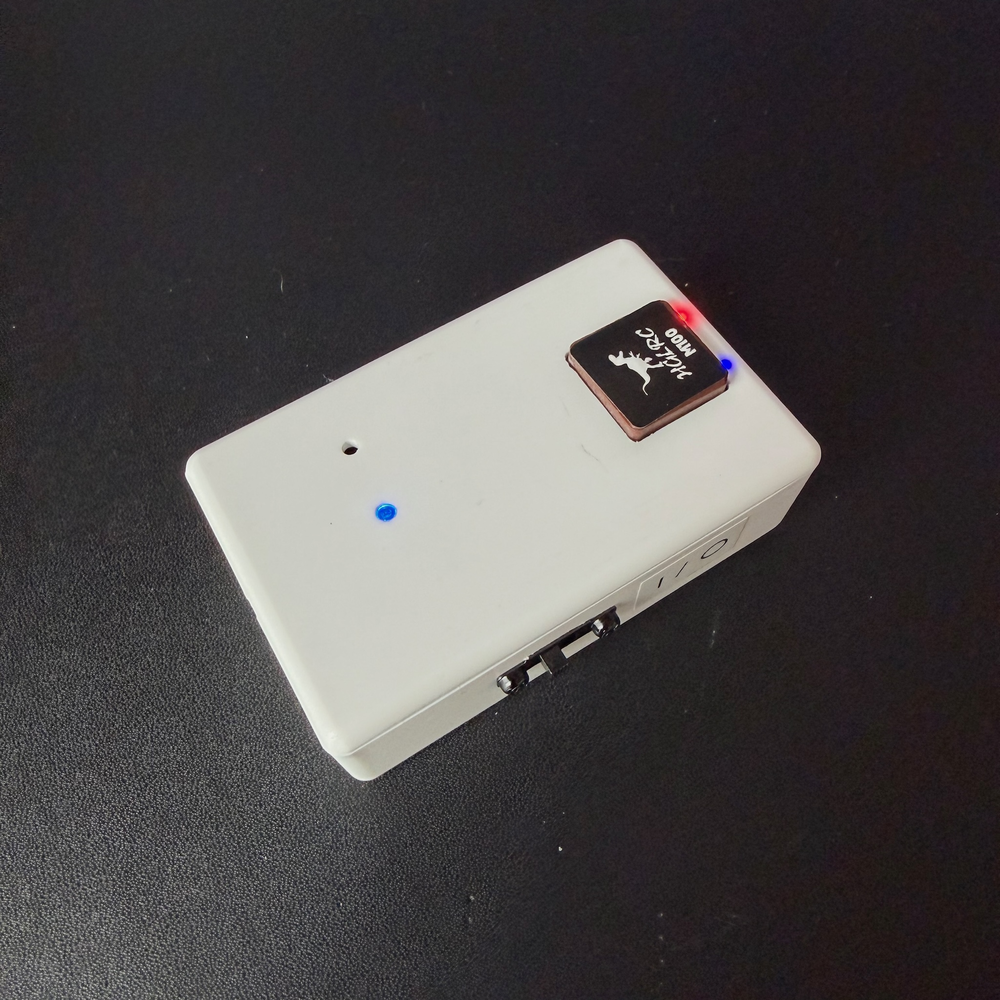

# Gnimu: GNSS+IMU data over BLE

[![License: GPL v3][License-shield]][License-link]
[![Platform: nRF52840][Platform-shield]][Platform-link]
[![Language: C++ (Arduino)][Language-shield]][Language-link]

This section of the repository is a **battery-powered** evolution of [Gnimu][0], re-targeted from the original always-on ESP32-based build to a **Seeed Studio XIAO nRF52840 Sense** [MCU][9] (MicroController Unit). It integrates a GNSS module and an IMU into a device that emulates a [RaceBox Mini][1] streaming telemetry meter. The official RaceBox app and other RaceBox-compatible tools can connect to it over BLE ([Bluetooth Low Energy][2]) and read live position, speed, and motion data at up to **25Hz** (more details on the nav rate is below). This version runs off a **3.7V LiPo battery** instead of a USB supply, uses the XIAO's **onboard 6-axis IMU**, and adds a full battery subsystem (charge detection, state-of-charge reporting, and a firmware low-voltage cutoff).

The advertised BLE identity and data streaming protocol stay exactly the same for RaceBox Mini app compatibility. The two streaming data changes compared to the ESP32-based version are actual battery charge percentage value (rather than reporting a fixed 100%), and charging status.

> [!IMPORTANT]
> **Unofficial project.** This is an independent, educational, and non-commercial implementation. It is **not affiliated with, endorsed by, or supported by RaceBox.** "RaceBox" and related marks belong to their respective owner. Use this code for learning and personal purposes only, and at your own risk. Do not use this code to impersonate a genuine device for any commercial or fraudulent purpose.

---

## What it does

- Reads a live [**GNSS fix**][3] (lat/long position, altitude, speed, heading, accuracy, fix status, satellite count) from a u-blox GNSS receiver.
- Reads **acceleration and rotation** from the XIAO's **onboard 6-axis IMU** (LSM6DS3TR-C). Each axis is smoothed with an EMA (Exponential Moving Average) filter and gets **transient-peak blending** so genuine short events (impacts, sharp inputs) survive the low-pass filter that would otherwise wash them out. Per-chip zero-point offsets are subtracted before any axis remap. These offsets default to 0, and should be measured per board via the IMU bench-calibration sketch that lives in the tools directory.
- Packs the GNSS and IMU data into a **RaceBox Data Message** (a u-blox UBX-framed binary packet) and streams it over **BLE** to any RaceBox-compatible client.
- **Runs on battery.** Reads its own LiPo voltage, reports state-of-charge and charging status in the RaceBox protocol's battery byte, and enforces a **firmware low-voltage cutoff** to protect the cell rather than rely on the presence of over-discharge protection circuitry in the LiPo (most LiPos do have over-discharge protection, so this is belt-and-braces).
- Advertises a BLE **Device Information Service** (model, serial, firmware, hardware, manufacturer) and a **Battery Service** so official apps recognize, pair with it, and display cell state.
- Drives an **RGB status LED** for advertising / connected / low-battery / charging, and prints a human-readable **serial status line** at 1 Hz for debugging.
- **Switches itself off when forgotten.** After `STATE_IDLE_TIMEOUT_MIN` (4 h by default) on battery with no app subscribed to its data, it drops to deep sleep (System OFF). A slide-switch cycle or a USB plug-in brings it back.

---

## Hardware

<table>
  <tr>
    <th width="30%" align="left">Part</th>
    <th align="left">Notes</th>
  </tr>
  <tr>
    <td>
        <a href="https://www.amazon.com/dp/B0DRNTLCWC"><strong>Seeed XIAO nRF52840 Sense</strong></a>
    </td>
    <td>
        The heart of the build: nRF52840 BLE SoC + onboard 6-axis LSM6DS3TR-C IMU + onboard LiPo charging, in a 21×18 mm footprint. Uses the mature Nordic/Adafruit Bluefruit BLE stack. More details at <a href="https://wiki.seeedstudio.com/XIAO_BLE/">the Seeed Studio Wiki</a>
    </td>
  </tr>
  <tr>
    <td><a href="https://www.amazon.com/dp/B0CB5N8RQ8"><strong>u-blox GNSS module</strong></a></td>
    <td>A u-blox M10-class GNSS receiver. The compass pins are unused.</td>
  </tr>
  <tr>
    <td>
        <strong><a href="https://www.amazon.com/dp/B0D8T3J8QZ">TPS63020 buck-boost regulator</a></strong>
    </td>
    <td>
        Supplies the GNSS a stable 3.3V rail across the full LiPo output range. Output-select set to 3.3V; PS pad shorted for forced-<a href="https://en.wikipedia.org/wiki/Pulse-width_modulation">PWM</a> (cleaner 3.3V output); EN pad broken out to the XIAO as the GNSS power gate.
    </td>
  </tr>
  <tr>
    <td>
        <strong><a href="https://www.amazon.com/dp/B0FR9LK28P">3.7V LiPo battery</a></strong>
    </td>
    <td>
        Flat pouch cell, 900mAh. Lands on the XIAO's BAT± pads. PCM protection circuit built-in for safety features including overcharge, over-discharge, overcurrent, and short-circuit protection. The firmware implements low-voltage cutoff logic as an additional protection against over-discharge.
    </td>
  </tr>
  <tr>
    <td>
        <strong><a href="https://www.amazon.com/dp/B0BWMS64PR">Latching 1P2T switch</a></strong>
    </td>
    <td>
        Switch inline on battery positive lead for full power disconnect. Slide to OFF position to store the unit between uses to preserve charge. Must be ON to charge the battery.
    </td>
  </tr>
  <tr>
    <td>
        <strong>
            <a href="https://www.amazon.com/dp/B08SC3F658">JST PH2.0 leads</a><br><br>
            <a href="https://www.amazon.com/dp/B0B2D8R9CX">JST 1.25 leads</a>
        </strong>
    </td>
    <td>
        JST PH2.0 and 1.25 male and female connector leads. Used for the connections to the LiPo, switch, TPS VIN/GND and XIOA BAT± pads.
    </td>
  </tr>
  <tr>
    <td>
        <strong><a href="https://www.amazon.com/dp/B08QRGJF5G">Resistors</a></strong>
    </td>
    <td>
        510kΩ resistors used in the voltage divider that supplies a signal for the power switch on/off sense controller.
    </td>
  </tr>
  <tr>
    <td>
        <strong><a href="https://www.amazon.com/dp/B0CNGJTKNK">USB-C right-angle adapter</a></strong>
    </td>
    <td>
        USB-C right-angle adapter used to help mount the XIAO in the project box. The adapter and XIAO module are affixed to the project box's lid and held in place with hardening putty. The socket of the adapter is exposed on the side of the project box. I took this approach as the XIAO does not have integrated standoff mounting holes, and I wanted to be able to mount the module in a way to both expose the USB-C port as well as keep the reset button and module LED close enough to a surface of the box to be useful.
    </td>
  <tr>
    <td>
        <strong><a href="https://www.amazon.com/dp/B0BQYPKRQS">Project box</a></strong>
    </td>
    <td>
        ABS plastic enclosure, 45mm × 75mm × 20mm. Openings are cut into the case to expose the GNSS antenna patch, GNSS indicator LEDs, XIAO reset button, XIAO LEDs, and the XIAO USB-C connector (for charging and firmware flash).
    </td>
  </tr>

</table>

---

## Wiring

### Logic Topology


### Signal connections

| From XIAO | To | Notes |
|---|---|---|
| **D6** (Serial1 TX) | GNSS **RX** | UART TX↔RX crossover |
| **D7** (Serial1 RX) | GNSS **TX** | UART TX↔RX crossover |
| **D9** | TPS63020 **EN** | GNSS power gate |
| **A4** | Switch-sense divider tap | Slide switch's spare pole through a 510kΩ / 510kΩ divider to ground; reads ~2V when OFF, ~0V when ON |

- The GNSS **SDA / SCL** (compass) pins are left unconnected as the firmware doesn't use them.
- **IMU** is onboard the XIAO and requires no wiring.
- **RGB LED** is onboard the XIAO.
- **Battery sense / charging** is onboard the XIAO (internal VBAT divider and USB-C charger).
- Pin assignments are documented and adjustable in [`config.h`][config]

### Power topology

The XIAO runs directly off the LiPo (its onboard charger/LDO intact); the buck-boost gives the GNSS a clean 3.3V rail. All four GND pins on the TPS63020 are a continuous bus.

```
        (+) ───┬─[ switch pos1 ]──┬─────────► XIAO BAT+
  LiPo         │                  └─────────► TPS63020 VIN
  3.7V         └─[ switch pos2 ]────────────► Voltage Divider Input
        (–) ────────────────────────────┬───► XIAO BAT-
                                        ├───► TPS63020 GND
                                        ├───► GNSS GND
                                        └───► Voltage Divider GND

  TPS63020 OUT (3.3V) ──────────────────────► GNSS VCC
  Voltage Divider OUT ──────────────────────► XIAO A4
```

## Build gallery

Photos of the reference build.

<table>
  <tr>
    <td align="center" valign="top" width="50%">
      <br>
      <sub>Components before assembly.</sub><br>&nbsp;
    </td>
    <td align="center" valign="top" width="50%">
      <br>
      <sub>TPS63020 buck-boost wired to the battery and GNSS.</sub><br>&nbsp;
    </td>
  </tr>
  <tr>
    <td align="center" valign="top" width="50%">
      <br>
      <sub>Bench testing on a breadboard.</sub><br>&nbsp;
    </td>
    <td>
        <br>
        <sub>Components wired and installed in case, held firm by hardening putty.</sub><br>&nbsp;
    </td>
  </tr>
  <tr>
    <td align="center" valign="top" width="50%">
      <br>
      <sub>The completed device, powered on and showing USB port.</sub><br>&nbsp;
    </td>
    <td align="center" valign="top" width="50%">
      <br>
      <sub>The completed device, powered on and showing slide switch.</sub><br>&nbsp;
    </td>
  </tr>
</table>

---

## Software & dependencies

- **[Arduino IDE][4]** (2.x recommended).
- **Board support — "Seeed nRF52 Boards"** (the **non-mbed**, Adafruit-nRF52-based core; **do not use** "Seeed nRF52 mbed-enabled Boards", which lacks Bluefruit). Add this Boards Manager URL, then install the package and select **Seeed XIAO nRF52840 Sense**:
  ```
  https://files.seeedstudio.com/arduino/package_seeeduino_boards_index.json
  ```
- Libraries (install via Library Manager):
  - **Seeed Arduino LSM6DS3** (onboard IMU)
  - **SparkFun u-blox GNSS Arduino Library** (GNSS)

> [!IMPORTANT]
> **macOS build gotcha:** The Seeed nRF52 core's `platform.txt` invokes bare `python` for its UF2 step, but modern macOS only ships `python3`, so compiling fails with `exec: "python": executable file not found in $PATH`.
>
> **Fix:** in `~/Library/Arduino15/packages/Seeeduino/hardware/nrf52/<version>/platform.txt`, change `python` to `python3` on the `recipe.objcopy.uf2.pattern` line. (note: this reverts on every core reinstall/update, so it must be re-done afterward)

---

## Build & flash

1. Install the board package and libraries above.
2. Open [`Gnimu-nRF52840.ino`][5].
3. Edit [`config.h`][config] — at minimum, set your `DEVICE_ID`.
4. Select **Seeed XIAO nRF52840 Sense** as the board and the correct serial port.
5. Click **Upload**. If the upload can't reset into the bootloader (common with BLE/SoftDevice sketches), **double-tap the reset button on the XIAO** to force it, then upload again.
6. Open the **Serial Monitor** at **115200 baud** to watch startup and status output.

> [!IMPORTANT]
> If you are building on an Apple Silicon Mac, you can use the AS-native Arduino IDE but you **must** have Rosetta installed in order to correctly compile the binary. Without Rosetta installed you will get a compilation error.

---

### Diagnostic sketches

The [`tools/`](../tools/nRF52840/) folder contains small standalone sketches that exercise individual subsystems in isolation — useful when bringing up new hardware or verifying a single piece of the pipeline without flashing the whole firmware. Each sketch has a comment header explaining what it tests. Highlights:

- `imu_probe`, `imu_tiltmap` — confirm the LSM6DS3 is reachable and map its axes to your enclosure.
- `imu_calibration` — bench measurement of per-chip zero-point offsets. **No longer feeds `config.h`**: `IMU_TRIM_*` learns the same correction at runtime. Kept as a diagnostic — screening a chip whose bias is out of spec, and providing the independent ground truth needed to validate the runtime trim against a known tilt.
- `led_check` — cycle every RGB LED color to confirm active-LOW wiring.
- `ble_mtu` — validate the raised BLE MTU + notify path.
- `gnss_en` — verify the TPS63020 EN gate truly disconnects the GNSS rail.
- `gnss_reset` — full GNSS factory reset, useful for recovering a receiver left in an unexpected config state. Lives in `src/tools/common/` rather than this variant's folder, since it is platform-neutral.
- `gnss_ver` — identity and high-rate capability report: raw UBX-MON-VER (which M10 part, which firmware/PROTVER), the receiver's CPU clock read back from the undocumented `0x40A4*` keys, the current rate/constellation config with the nav rate that combination is rated for, an inventory of every message with a non-zero `CFG-MSGOUT` rate alongside the port's UBX/NMEA protocol filter, and a 60-second measured fix rate with an `iTOW` gap histogram. Answers whether a board is clocked for the 25Hz/20Hz figures or only the 18Hz/10Hz default row — the distinction the M10 datasheets footnote as "Configuration required" — and then whether running past that rating actually costs you epochs. Phases 1–5 are read-only; phase 6's only write is enabling NAV-PVT on the RAM layer (set `MEASURE_SECONDS` to 0 to skip it). Also in `src/tools/common/`; it compiles for both the nRF52840 and ESP32 trees.
- `gnss_otp_clock` — programs the u-blox M10 high-performance CPU clock into the receiver's OTP memory (MAX-M10S Integration manual §2.1.7), lifting the rating from 18Hz/10Hz to 25Hz/20Hz for 1/2 constellations. Reads all three config layers first, halts and does nothing if the clock is already programmed or the part isn't an M10 at the stock clock, and otherwise waits for the operator to type `BURN` before writing. **The write is permanent and cannot be reverted**, and consumes 18 of the receiver's 64 bytes of OTP space. Also in `src/tools/common/`.
- `battery_presence` — check the A4 switch-sense divider reads clean 0mV ON / ~2V OFF.
- `battery_log` — logs VBAT through a full plug-in → charge → unplug → settle cycle to internal flash (survives being unplugged from Serial), auto-flagging when charging plateaus and when the post-unplug reading has truly settled. Use this to capture the cell's real resting voltage at full charge for tuning `BATTERY_DISCHARGE_CURVE`'s 100% anchor — something you can't read directly off BAT+/- while USB is still driving it. Holds the GNSS rail off for the whole test so its ~30mA load doesn't skew the readings. Reconnect USB + open Serial anytime (mid-test or after) and type `d`/`e` to dump or erase the log.
- `storage_check` — standalone QSPI + LittleFS hardware validation (chip detection, mount, format, read/write/delete). Not currently used by the main firmware; kept as a diagnostic for the onboard flash chip itself.

---

## Configuration

Settings live in [`config.h`][config], grouped into sections, with one exception: the IMU tuning (smoothing, transient thresholds, `IMU_TRIM_*`) is the same on every Gnimu board, so it lives in [`g_imu_tuning.h`](g_imu_tuning.h), which `check_common.sh` keeps identical across all three trees. Highlights:

| Setting | Purpose |
|---|---|
| `DEVICE_ID` | 10-digit device serial as a **quoted string** (e.g. `"1001001001"`). Validated at compile time: exactly 10 digits, first digit `0`–`3`. |
| `TELEMETRY_PROTOCOL` | Which wire protocol this build emits. `PROTO_RACEBOX` is currently the only implemented value. Chosen at compile time, so unselected protocols are never linked and cost no flash — the trade is that switching needs a reflash. A protocol's own constants (identity strings, service and characteristic UUIDs) live in `g_proto_<name>.h` rather than here, so they stay under `check_common.sh`. |
| `GNSS_EN_PIN` | GNSS power-gate pin (`D9`) wired to the TPS63020 EN pad. |
| `GNSS_BAUD` | GNSS serial baud. On boot `connectAndConfigureBaud()` finds the module at any common rate, switches it to `GNSS_BAUD`, and saves the config to flash, so a change survives the next boot. Lower rates widen the window `gnssPoll()` has to drain the ~64-byte RX buffer — see the rate table in [`config.h`][config]. |
| `GNSS_NAV_RATE_HZ` | GNSS PVT rate in Hz (1–25). Set once at startup and held for the life of the session, connected or not. |
| `GNSS_CONSTELLATIONS` | Macro-array of `{name, id, enabled}` entries — one line per constellation the M10 supports (GPS only by default). |
| `IMU_ACCEL_RANGE_G`, `IMU_GYRO_RANGE_DPS`, `IMU_*_ODR_HZ` | LSM6DS3 full-scale ranges and output data rates, as plain integers. The rates are validated against the list the Seeed library actually maps (13–833, 1660, plus 3330/6660 for the accel) — anything else silently becomes 104 Hz. The driver reads all of it back at boot and refuses to come up if the chip did not take it. |
| `IMU_ACCEL_LPF1_ODR_DIV` | The accelerometer's digital low-pass filter (LPF1), as the ODR divider the part implements: `2` or `4`. At 104 Hz that is 52 Hz or 26 Hz; the shipped `4` gives 26 Hz. It replaced `IMU_ACCEL_BANDWIDTH_HZ`, which was wrong in name and value: the Seeed library targets the original LSM6DS3, where those register bits are an analog anti-alias filter, while the TR-C fitted here splits them into an analog bit (inert below 1.67 kHz) and this divider. A compile-time check rejects any combination whose cutoff would alias against the rate `imuPoll()` reads at. |
| `IMU_ACCEL_ALPHA`, `IMU_GYRO_ALPHA`, `IMU_ACCEL_TRANSIENT_THRESHOLD_G`, `IMU_GYRO_TRANSIENT_THRESHOLD_DPS` | Per-axis IMU smoothing (EMA alpha) and the deviation each transmit window's peak must exceed before it's blended into the reported value — surfaces genuine short events (impacts, sharp inputs) that a plain EMA would wash out. The accel values are tuned against GNSS-referenced track data (2018 M2); the gyro values remain untested placeholders. Both are car- and mount-specific — the threshold must sit above your vibration floor, or the blend fires continuously and inflates reported peaks. |
| `IMU_TRIM_*` | Runtime levelling and gyro de-biasing. After 30 s continuously stationary with a valid 3D fix, the firmware measures its own mounting tilt and gyro zero, applies them, and **locks the orientation for the rest of the power cycle**. Replaces the old per-board calibration step — the firmware image is now identical on every unit. `IMU_TRIM_REQUIRE_FIX 0` for bench testing, which never gets a fix indoors. See [`docs/imu-trim-design.md`](../../docs/imu-trim-design.md). |
| `IMU_ENABLED` | Set automatically from the board selected in the IDE: `1` for the XIAO nRF52840 Sense (which has the onboard IMU), `0` for the plain XIAO nRF52840. With `0` the IMU fields read zero, trim never runs, the Seeed LSM6DS3 library isn't needed to build, and light sleep can only be ended by an app connection or the switch (no motion wake). To override, replace the block with a plain `#define`. |
| `IMU_AXIS_X/Y/Z_SRC`, `IMU_AXIS_X/Y/Z_SIGN` | Mounting-orientation remap into the vehicle frame. Each vehicle axis names which sensor axis feeds it (`0`=X, `1`=Y, `2`=Z) plus a sign, covering all **24** physically-realizable orientations. A determinant `static_assert` rejects a mirrored (impossible) map at compile time. Derivation procedure and the order table are in `config.h`; this build ships order `XYZ` with signs `−1, −1, +1` (USB-C forward). |
| `BLE_TX_POWER_ADV`, `BLE_TX_POWER_CONN` | BLE transmit power in **dBm** while advertising vs connected (both default `-12`). **Lower = quieter radio = better GNSS lock** — see below. |
| `LOW_BATT_CUTOFF_V`, `LOW_BATT_WARN_V`, `LOW_BATT_CRITICAL_V`, `BATTERY_FULL_V`, `BATTERY_DISCHARGE_CURVE`, `BATTERY_FAST_CHARGE` | Low-voltage cutoff, amber-warn and red-critical LED thresholds, "fully charged" LED threshold, the LiPo voltage→percent curve, and fast-charge select. |
| `BATTERY_POLL_INTERVAL_MS`, `BATTERY_SAMPLE_COUNT`, `BATTERY_SAMPLE_SPACING_US`, `BATTERY_ADC_TACQ_US`, `BATTERY_EMA_ALPHA` | Non-blocking VBAT sampler cadence, samples per run, pacing between reads, the SAADC acquisition-time setting (40 µs is required for the XIAO's ~338 kΩ divider), and the display-voltage smoothing factor. |
| `SWITCH_SENSE_PIN`, `SWITCH_OFF_THRESHOLD_MV` | Slide-switch position sense (`A4` divider) — reads > threshold = switch OFF = BATTERY_WAIT. |
| `STATE_CHARGE_ONLY_ON_USB` | `1` (default) auto-enters CHARGE_ONLY on USB plug-in so the charger can top the cell up at full current; `0` stays in RUNNING while plugged in (for bench development). |
| `STATE_IDLE_TIMEOUT_MIN` | Minutes on battery with no BLE client **subscribed** (a bare connection does not count) before RUNNING → DEEP_SLEEP. Default 240 (4 h). The clock stands still on USB power. |
| `BATTERY_WAIT_BLINK_MS`, `LED_BLINK_INTERVAL_MS` | Rapid-red blink half-period for BATTERY_WAIT; standard blink half-period for the other states. |
| `LOG_ENABLED` | Master switch for all Serial diagnostic output. `1` (default) = normal verbose logging over USB. `0` = **silent build**: every `LOG_*` call vanishes at preprocessor level (both the call and its arguments), and `Serial.begin()` + the 3 s USB-CDC enumeration wait in `setup()` are `#if`-guarded out. Silent-mode boots go straight through without waiting on a host that will never open the port. Turn this off for production firmware where you don't need diagnostics, as it slightly decreases loop latency to ensure rock-solid 25Hz operation. |

Many values are checked with `static_assert` at compile time, so an invalid configuration fails the build with a clear message instead of misbehaving on the device.

### A note on BLE power and GNSS lock

GNSS reception is sensitive to nearby RF noise, and a compact build puts the BLE radio right next to the GNSS front end. Keeping the BLE TX power low (`BLE_TX_POWER_ADV` / `BLE_TX_POWER_CONN`, both default **−12dBm**, with advertising and connected set independently) keeps the radio quiet. The receiver is usually close by, so high power isn't needed. Lower BLE transmit power can dramatically improve fix quality. Running the GNSS from the **3.3V buck-boost rail** (rather than 5V) further reduces supply noise.

### A note on GNSS fix rate and enabled constellations

The maximum PVT rate on the u-blox M10 platform depends on how many constellations you enable and, less obviously, on a CPU clock setting that ships at a lower rate. Both rows are published u-blox specifications [UBX-23006557][ubx-m10-specs]:

| Concurrent constellations | 1 | 2 | 3 | 4 |
|---|---|---|---|---|
| Stock CPU clock (as shipped) | 18Hz | 10Hz | 10Hz | 5Hz |
| High CPU clock (see below) | **25Hz** | **20Hz** | 16Hz | 10Hz |

The high row is the one every M10 spec sheet quotes, and the datasheets footnote it as *"Configuration required."* That footnote means something specific: u-blox ships M10 silicon at a reduced CPU clock (128/128/128/64MHz) to save power, and the higher rates need a **one-time, permanent write of a faster clock (192/192/192/96MHz) into the receiver's OTP memory** per the MAX-M10S Integration manual UBX-20053088 §2.1.7. Simply choosing constellations and setting `GNSS_NAV_RATE_HZ` does *not* get you there without the CPU clock rate change.

Gnimu ships `GNSS_NAV_RATE_HZ 20` with **GPS + Galileo** enabled, which require the higher clock rate. On a stock-clock module that is twice the rated 10Hz. u-blox permits running past the rating ("the navigation update rate can be increased beyond the maximum value stated in the datasheet. However, this may result in a reduced fix rate"), so the receiver does not reject the setting; it silently skips navigation epochs when it cannot keep up. Measured fix rates on a stock-clock module at 7–9 satellites show no loss at all, while asking for 25Hz on two constellations does produce visible rate fluctuation. But the manual attributes rate loss to *"a very large number of satellites"*, so a thin sky is the easy case and a clean result there does not generalise to an open one. For use as a motorsports telemetry device, a solidly consistent nav rate and higher position accuracy are key attributes, so two constellations at 20Hz is a good compromise to get high-resolution position and speed.

**Check your own module rather than trusting either row.** [`tools/common/gnss_ver`](../tools/common/gnss_ver/gnss_ver.ino) reports which row your receiver is on, what it is currently configured for, and the fix rate it actually delivers over a 60-second window. [`tools/common/gnss_otp_clock`](../tools/common/gnss_otp_clock/gnss_otp_clock.ino) performs the OTP write, behind a typed confirmation. **That write cannot be undone**, and it consumes 18 of the receiver's 64 bytes of OTP space.

A valid alternative is to run **GPS only at 25Hz**. This is also a high-clock figure, so it needs the OTP write as well. A stock-clock module tops out at 18Hz on a single constellation. This costs you the second constellation's geometry, and the accuracy difference can be visible. If you would rather have the higher rate at the expense of potentially lower accuracy, set `GNSS_NAV_RATE_HZ 25` and disable Galileo (or GPS, depending on where you are in the world) in `GNSS_CONSTELLATIONS`.

**Why the real RaceBox Mini delivers 25Hz:** it uses a [u-blox NEO-M9N][ubx-m9n-specs] GNSS, which is a different platform that does not derate at higher constellation counts. The M9N datasheet lists 25Hz for *every* configuration, from a single constellation up to GPS+GLO+GAL+BDS concurrently. The drawback is higher power consumption and cost. The M10 is an economical choice for a small battery-powered device, but the 20 Hz ceiling for GPS+GAL is the downside. If you want to try and fully emulate a RaceBox Mini, a NEO-M9N module shouldn't be too hard to integrate with this code (it's perhaps even a drop-in), but it will likely run 3x the cost or more than an M10 unit and draw substantially more power.


---

## Battery & power

- The XIAO runs directly off the **LiPo** and charges it over **USB-C**. A **slide switch** gives a full battery disconnect for storage.
- The firmware reads the LiPo voltage, maps it to a percentage via the discharge curve defined in `config.h`, detects charging from USB/VBUS, and writes both into the **RaceBox protocol battery byte** (offset 67: charging bit + percent).
- A **state machine** orchestrates power behavior across five operating states: normal **RUNNING**; **CHARGE_ONLY** while plugged in (peripherals held off so the charger gets max current to the cell); a switch-off **BATTERY_WAIT** idle; and **DEEP_SLEEP** (System OFF) on the low-battery cutoff or after `STATE_IDLE_TIMEOUT_MIN` on battery with no app subscribed. There is no intermediate sleep: a LIGHT_SLEEP state (GNSS backup mode, shake-to-wake) was removed on 2026-09-11 as the firmware's most intricate machinery for a saving only a forgotten device ever collected.
- The firmware enforces a **low-voltage cutoff**. On a sustained VBAT drop below `LOW_BATT_CUTOFF_V` while running on the LiPo (not while charging), the firmware cleanly stops BLE, cuts the GNSS rail, powers the IMU down, and puts the nRF52840 into System OFF deep sleep to prevent LiPo over-discharge. Recovery is a USB plug-in or a slide-switch off→on cycle (though if the battery is not recharged before a power cycle, it will power down again).
- **Plugging in USB with the switch ON auto-enters CHARGE_ONLY** — the LED continues to signal charging (green blink → solid green when full) but GNSS/IMU are held off and BLE stops advertising, so all available current goes to charging. Unplug USB or flip the switch off to leave the state (both trigger a reset back through the boot classifier). If you want the device to keep streaming/serving BLE while plugged in for bench work, set `STATE_CHARGE_ONLY_ON_USB` to `0` in `config.h`.
- **With the switch OFF and USB plugged in, the device is in BATTERY_WAIT** — the LED blinks **rapid red** as a "check the switch" signal and no peripherals are powered up. Flipping the switch back on resets the device into normal operation. Without the switch on, no charging occurs (the switch is inline with the battery+ path). Switch position is detected via a hardware switch-sense line — the slide switch's spare throw feeds a 510kΩ / 510kΩ divider to pin `A4`, giving a load- and SoC-independent signal that survives while the device is actively streaming.

### Estimated runtime (900 mAh cell)

| Scenario | Estimate |
|---|---|
| Continuous RUNNING (BLE connected, GNSS fixing, streaming) | **~16–20.5 hours** |
| Left on and forgotten (no app subscribed, on battery) | **4 h at RUNNING draw** (roughly a fifth to a quarter of the cell), then DEEP_SLEEP: **months++** |
| Switch OFF, disconnected (storage) | **Years, not days** — standby loss is dominated by the battery's own self-discharge, not the firmware or circuit. |

---

## Usage

1. Charge the LiPo (plug in USB-C, set switch ON) before disconnected use.
2. Disconnected from USB, slide switch to ON and give the GNSS time to acquire a fix. The LED **blinks blue** while advertising and disconnected from a receiver.
3. The M100's own LEDs report GNSS status (see table below).
2. In the **RaceBox-compatible app**, scan for and connect to the device by it's advertised name (`MODEL` + `DEVICE_ID`, e.g., "RaceBox Mini 1001001001").
3. On connect, the LED turns **solid blue** and the device begins streaming data packets.
4. Optional: If connected via USB with the serial monitor open at 115200 baud, live diagnostics will print at 1Hz.

### Gnimu status LED

The XIAO's onboard RGB LED signals state:

| Color | Meaning |
|---|---|
| 🟢 Green (blinking) | Charging (USB connected). |
| 🟢 Green (steady) | Fully charged (USB connected). |
| 🟡 Amber (blinking) | Low battery — warning (~5% SoC). |
| 🔴 Red (blinking) | Low battery — critical (~1% SoC). |
| 🔴 Red (rapid blink) | **BATTERY_WAIT** — switch is OFF. Switch ON to charge. |
| 🔵 Blue (steady) | BLE client connected. |
| 🔵 Blue (blinking) | BLE advertising, waiting for a connection. |

### M100 GNSS LED indicators

These are the M100 module's own LEDs (not driven by our firmware) — useful for judging fix status without a serial connection.

| LED | Pattern | Meaning |
|---|---|---|
| Red (power) | Solid | GNSS rail powered |
| Blue (PPS) | Fast flicker | Powered, no fix acquired yet |
| Blue (PPS) | Fast flicker w/ 1Hz blink | 3D fix & time lock acquired |

---

## Troubleshooting

| Symptom | Things to check |
|---|---|
| LED blinks **rapid red** and nothing else works | The slide switch is **OFF** while USB is connected — the device is in BATTERY_WAIT (see Battery & power). Flip the switch on with a battery connected to boot normally. |
| Device is plugged in + switch ON but doesn't appear in BLE scans / won't accept a connection | With default settings (`STATE_CHARGE_ONLY_ON_USB = 1`) plugging in auto-enters CHARGE_ONLY — BLE is disconnected and advertising is stopped so the charger can top the cell up at full current. Unplug USB to return to RUNNING. If you need BLE while plugged in (bench development), set `STATE_CHARGE_ONLY_ON_USB = 0` in `config.h` and reflash. |
| Device does nothing at all (no LED, no serial activity) when plugged into USB | Check that a charged battery is actually connected — the slide switch alone doesn't power the MCU from USB unless VBUS is also present. Confirm the USB cable/port carries data, not just power. |
| `Failed to find IMU module` | Confirm that you have a **"Sense"** XIAO (the plain XIAO has no IMU); reflash. |
| `u-blox GNSS not detected` | UART wiring (note TX↔RX crossover), the 3.3V rail (measure it), `GNSS_BAUD`, and that the TPS63020 EN pin is high/enabled. |
| Few or no satellites | Move outdoors or near a window; keep the BLE TX power low; check which constellations are configured; give it a cold-start minute. |
| App won't connect | Confirm `DEVICE_ID` is valid (10 digits, first digit 0–3); make sure no other client already holds the (single) connection. |
| `exec: "python"` compile error (macOS) | Apply the `python`→`python3` `platform.txt` fix (see Software & dependencies). |
| Upload won't start | Double-tap the reset button to force the bootloader, reselect the port, upload again. |
| Build fails with a `static_assert` message | Read the message — it names the offending `config.h` value and the allowed range. |

---

## Credits

Gnimu nRF52840 is the battery-powered port of the original **Gnimu ESP32** build, which itself is a major evolution of the [**Open-Source RaceBox Mini Emulator**][6] by [**Anchit Chandra Sekhar**][7]. This version re-targets the whole design to a battery-powered platform: a full BLE rewrite (ESP32 → Nordic Bluefruit), the onboard LSM6DS3TR-C IMU, and a new battery subsystem with a low-voltage cutoff. Anchit has developed an nRF52840 port as well, but this firmware was not based on that code.

Protocol details follow the *RaceBox BLE Protocol Description*, [available from RaceBox][8].

---

## License

Released under the **GNU General Public License v3.0** — see [`LICENSE`](../../LICENSE). As a derivative of the GPL-v3 licensed Gnimu / Open-Source RaceBox Mini Emulator, Gnimu nRF52840 carries the same license.

[License-shield]: https://img.shields.io/badge/License-GPLv3-blue.svg
[Platform-shield]: https://img.shields.io/badge/platform-nRF52840-00A9CE.svg
[Language-shield]: https://img.shields.io/badge/language-C%2B%2B%20(Arduino)-00599C.svg
[License-link]: ../../LICENSE
[Platform-link]: https://wiki.seeedstudio.com/XIAO_BLE/
[Language-link]: https://www.arduino.cc/
[config]: ./config.h
[ubx-m10-specs]: https://content.u-blox.com/sites/default/files/documents/u-bloxM10-with-25Hz-Navigation-UpdateRate_IN_UBX-23006557.pdf
[ubx-m9n-specs]: https://content.u-blox.com/sites/default/files/NEO-M9N-00B_DataSheet_UBX-19014285.pdf

[0]: ../Gnimu-ESP32/README.md
[1]: https://www.racebox.pro/products/racebox-mini
[2]: https://en.wikipedia.org/wiki/Bluetooth_Low_Energy
[3]: https://en.wikipedia.org/wiki/Satellite_navigation
[4]: https://www.arduino.cc/en/software
[5]: ./Gnimu-nRF52840.ino
[6]: https://github.com/anchit92/Open-Source-RaceBox-mini-Emulator
[7]: https://github.com/anchit92
[8]: https://www.racebox.pro/products/mini-micro-protocol-documentation
[9]: https://en.wikipedia.org/wiki/Microcontroller
